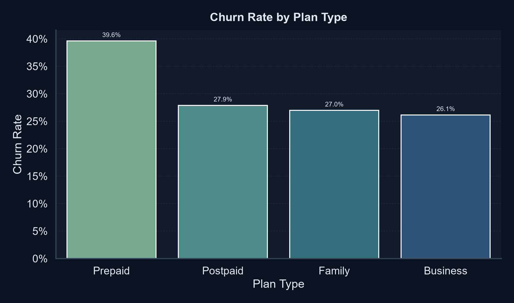
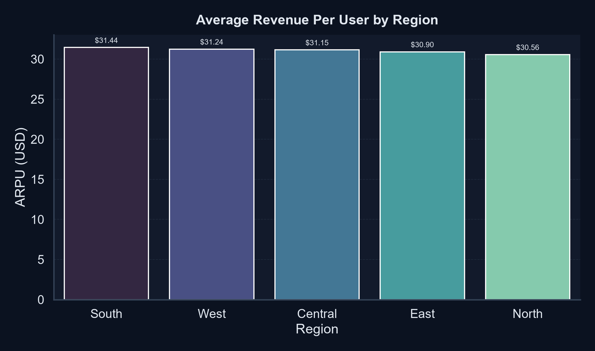
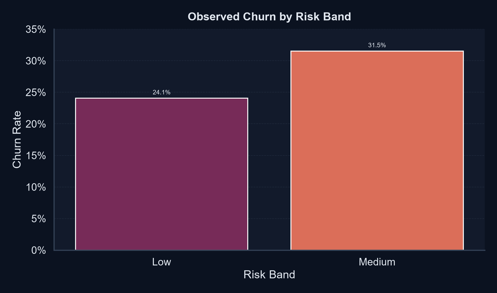

# Telecom Customer Value Analytics

A telecom churn and customer value analytics portfolio project built to show end-to-end data analysis, business storytelling, and actionable retention insights.

## Business Problem

Telecom companies often lose revenue through preventable churn. This project analyzes customer behavior, value, and churn risk using a realistic data pipeline and stakeholder-friendly outputs.

## Key Business Impact

| Metric | Result |
|---|---:|
| Total Customers | 12,000 |
| Churn Rate | 31.6% |
| ARPU | $31.07 |
| Average Tenure | 36.77 months |
| Most Important Signals | Support tickets, payment delay, tenure, plan type |

## What This Project Covers

- Customer value segmentation
- Churn risk analysis
- Retention strategy support
- SQL-ready analytical layers
- Dashboard and presentation-ready outputs
- Python-based data pipeline and testing

## Project Architecture

```text
Generate data -> Clean & transform -> Feature engineering -> Segment customers -> Analyze KPIs -> Visualize -> SQL reporting
```

## Tech Stack

- Python: pandas, numpy, matplotlib, seaborn
- SQL: schema + views + analytical queries
- Testing: pytest
- BI: Power BI-ready dashboard blueprint

## Quick Start

```bash
python -m venv .venv
.venv\Scripts\activate
pip install -r requirements.txt
python src/run_pipeline.py
pytest -q
```

## Visual Storytelling

### Churn by Plan Type

[Churn by plan type](results/figures/01_churn_by_plan.png)



### ARPU by Region

[ARPU by region](results/figures/02_arpu_by_region.png)



### Risk Segmentation

[Risk segmentation](results/figures/03_risk_band_churn.png)



## Business Findings

- Payment delays and support burden are strongly associated with churn risk
- Lower-tenure customers show higher churn exposure
- Prepaid and lower-value plans have higher churn intensity
- High-value segments are a key retention opportunity
- Regional differences matter for targeted campaign design

## Deliverables

- Data generation and ETL pipeline
- Customer segmentation and KPI analysis
- SQL schema and analytical views
- Result exports for business reporting
- Visualization pack for stakeholder communication
- Power BI dashboard blueprint
- Automated test validation

## Portfolio Value

This project demonstrates the kind of work expected in real analyst roles:

- data cleaning and feature engineering
- business problem framing
- analytical storytelling
- SQL and Python fluency
- dashboard-aware communication
- reproducible and portfolio-ready output

## License

This project is licensed under the MIT License. See [LICENSE](LICENSE).
